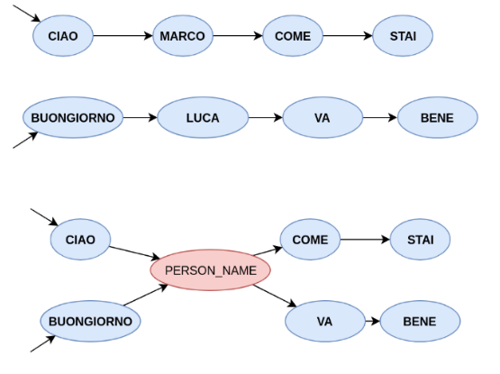
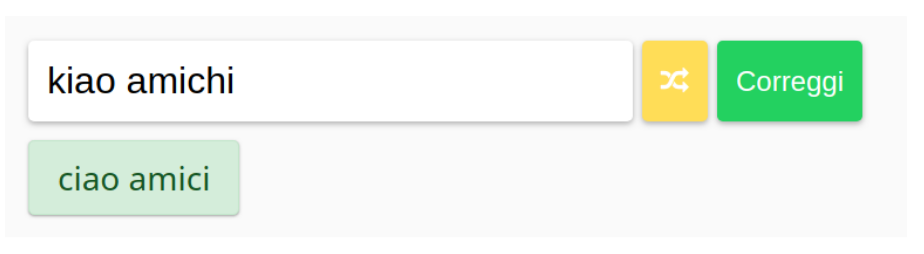

# HMM Corrector

A language-agnostic spellchecker and corrector based on Hidden Markov Models. The mistakes are discovered using the concept of probabilistic edit distance and the correction using the Viterbi alghoritm on a special kind of HMM. Both the concept of probabilistic distance, the generalized HMM used in the corrector and the search space reduction are novel ideas in the field.

The generalization of the underlying MM:

It provides a Web Interface, a CLI interface and a ready-to-import class with methods.

The Web Interface of the project:

Authors: Cristian Baldi - Simone Vitali

This work was developed as the final project of the course "Probabilistic Models" at University of Milano Bicocca.

## How to install

* `git clone` this repo
* `pip install -r requirements.txt`

## Trying the correction model

* `python correct.py` for command line usage
* `python web_interface.py` for a web bases interface

## Building a new model

The projects include a model able to correct italian sentences.

* Create a folder inside `data/` and name it whatever you want
* Add some `.txt` files to it
* Change the current model in `config.py`
* Run `python learn.py` and `python build_model.py`
* You can now use it.

## Running performance tests

* `python performance_tests.py`

## Files and folders

* `data/`, data for building the model and running the correction alghoritm
* `web_interface`, files for the web interface
*  `build.py`, build the required objects for running the model
*  `build_test_set.py`, build the test set for running tests
*  `config.py`, configuration file
*  `correct.py`, command line interface
*  `learn.py`, analyze the text and build word distributions and transitions probability
*  `probabilistic_distance.py`, compute the probabilistic distance between two strings
*  `performance_test.py`, run tests
*  `Viterbi.py`, implements the viterbi algorithm and state selection functions
*  `web_interface.py`, runs the web interface

## Raw Dataset

For the purpose of the project it was used a dataset with italian tweets available here: https:// datacloud [DOT] di.unito [DOT] it/index.php/s/Wn8tRFyETxZkqJc
